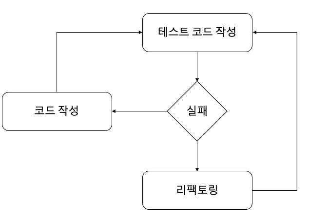

# kevin-dev-spring-tdd

## Index
- [Overview](#overview)
- [Getting Started](#getting-started)
- [Release Notes](#release-notes)
- [Issues](#issues)
- [Contributing](#contributing)
- [Authors](#authors)
- [License](#license)
- [References](#references)
- [Commit Message (Gitmoji)](#commit-messages-gitmoji)

## About
Spring Boot TDD 학습을 위한 프로젝트입니다.

## Overview
이용할 수 있는 기능은 없습니다.

## Getting Started
Spring Boot 기본 구성으로 진행했습니다.

### TDD 
TDD는 작동하는 깔끔한 코드를 만드는 것이 목표다.

1. 자동화된 테스트가 실패한 경우만 새로운 코드를 작성
2. 중복 제거
3. 실패하는 테스트를 작성하기 전에 코드를 작성하지 않음
4. 실패하는 테스트 코드를 한번에 하나 이상 작성하지 않음
5. 실패하는 테스트를 통과하기에 충분한 정도를 넘어서는 코드를 작성하지 않음

### TDD advantages
1. 코드 유지보수가 용이
2. 소스코드의 기록
3. 프로그래밍 시간 단축

### TDD disadvantages
1. 프로그래밍 시간 증가

### Unit test
- 소스 코드의 특정 모듈이 의도된 대로 정확히 작동하는지 검증하는 테스트
- FIRST 원칙 (Fast, Independent/Isolated, Repeatable, Self Validating, Timely)

### Integration test
- 단위 테스트 이후 모듈들의 상호작용이 제대로 이루어지는지 검증하는 테스트

### Process
1. 테스트 추가
2. 모든 테스트를 실행하고 새로 추가한 것이 실패하는지 확인
3. 코드를 조금 변경
4. 모든 테스트를 실행하고 전부 성공하는지 확인
5. 리팩토링을 통해 중복을 제거

### Environment
- Local
- Dev & Stage
- Prod

### Project Structures

### Installing
1.

## Release Notes
* 0.0.1
    * 테스트
    * 작업 진행 중

## Issues
없습니다.

## Contributing
ozofweird

## Authors
- [ozofweird](https://github.com/ozofweird) - **Kevin Ahn**

## License
ozofweird

## References

---

## Commit messages (Gitmoji)

|Gitmoji|Code|Description|
|:-----:|:---:|:--------:|
|🎨|art|파일/코드 구조 개선|
|🩹|adhesive_bandage|간단한 수정|
|⚡️|zap|성능 향상|
|🔥️|fire|코드나 파일 삭제|
|🐛️|bug|버그 해결|
|🚑️|ambulance|긴급 수정|
|✨️|sparkles|새로운 기능|
|📝️|memo|문서 추가/수정|
|💄️|lipstick|화면 UI 추가/수정|
|🎉️|tada|프로젝트 시작|
|✅️|white_check_mark|테스트 추가/수정|
|🔒️|lock|보안 이슈 수정|
|🔖️|bookmark|릴리즈/버전 태그|
|🚧|construction|작업 진행 중|
|💚|green_heart|CI 빌드 수정|
|⬇️|arrow_down|의존성 버전 다운|
|⬆️|arrow_up|의존성 버전 업|
|📌|pushpin|특정 버전 의존성 고정|
|👷|construction_worker|CI 빌드 시스템 추가/수정|
|📈|chart_with_upwards_trend|분석, 추적 코드 추가/수정|
|♻️|recycle|코드 리팩토링|
|➕|heavy_plus_sign|의존성 추가|
|➖|heavy_minus_sign|의존성 제거|
|🔧|wrench|설정 파일 추가/수정|
|🔨|hammer|개발 스크립트 추가/수정|
|🌐|globe_with_meridians|다국어 지원|
|💩|poop|안좋은 코드 추가|
|⏪|rewind|변경 내용 되돌리기|
|🔀|twisted_rightwards_arrows|브랜치 합병|
|👽|alien|외부 API 변화로 인한 수정|
|🚚|truck|리소스 이동/이름 변경|
|💥|boom|놀라운 기능 소개|
|🍱|bento|에셋 추가/수정|
|💡|bulb|주석 추가/수정|
|💬|speech_balloon|스트링 파일 추가/수정|
|🗃|card_file_box|데이버베이스 관련 수정|
|🔊|loud_sound|로그 추가/수정|
|🔇|mute|로그 삭제|
|📱|iphone|반응형 디자인|
|🙈|see_no_evil|gitignore 추가|